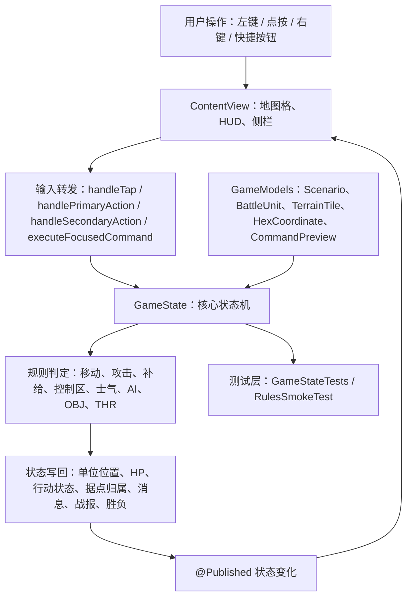
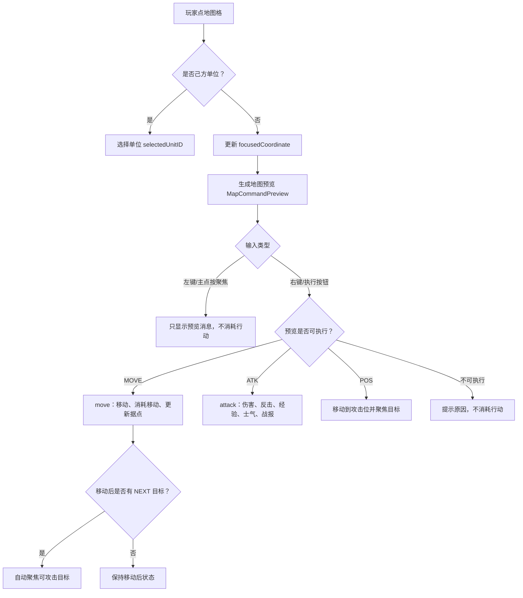
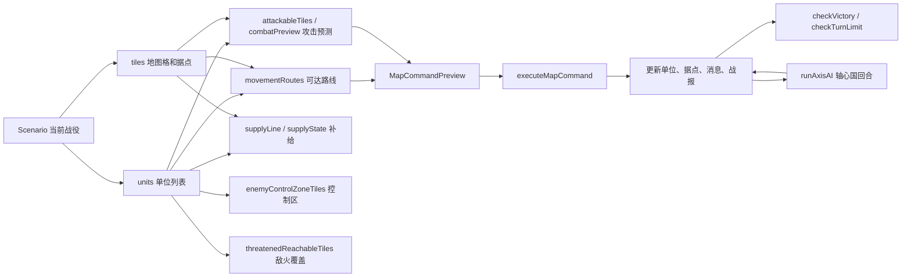
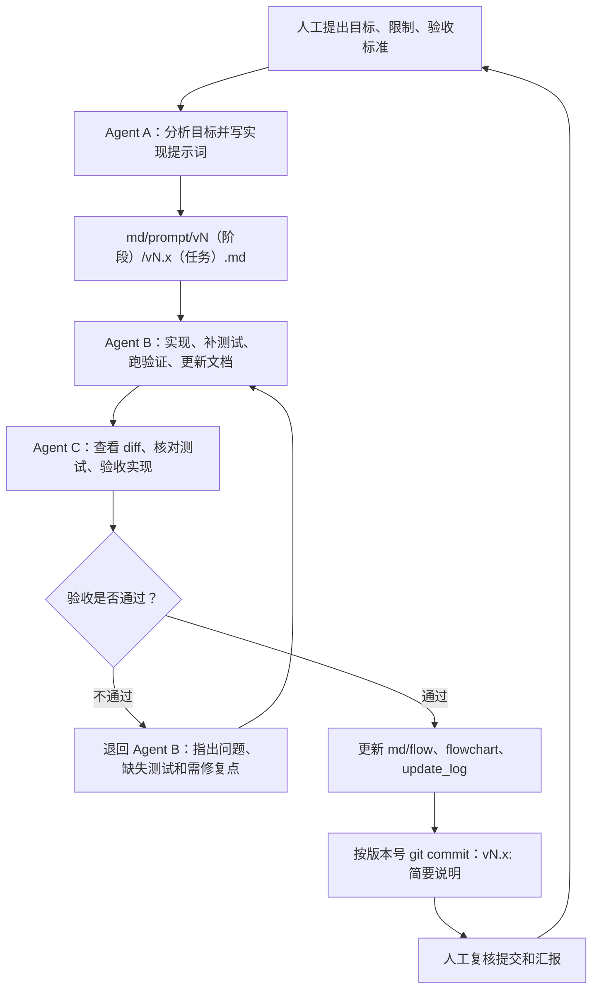

# 项目流程图

本文用 Mermaid 图把当前真实逻辑画出来。每张图前都有读图说明，方便人工快速理解。

## 1. 核心逻辑图

读图说明：这张图从玩家输入开始，看状态如何进入 `GameState`，再如何通过规则更新并回到 SwiftUI 界面。左侧是用户入口，中间是规则状态机，右侧是渲染和测试。

## 2. 地图命令执行流

读图说明：这张图展示地图交互的安全边界。聚焦只看信息，不消耗行动；右键或执行按钮才会进入实际命令执行。

## 3. 规则状态图

读图说明：这张图展示 `GameState` 内部主要规则之间的关系。移动、攻击、补给和 AI 都会影响战役状态，最后统一进入胜负检查。

## 4. Agent 迭代流程图

读图说明：这张图展示后续项目不再由单个 Agent 直接乱改，而是按 A 设计、B 实现、C 验收、通过后自动按版本提交、人工复核循环推进；如果 C 不通过，则退回 B 修复。

