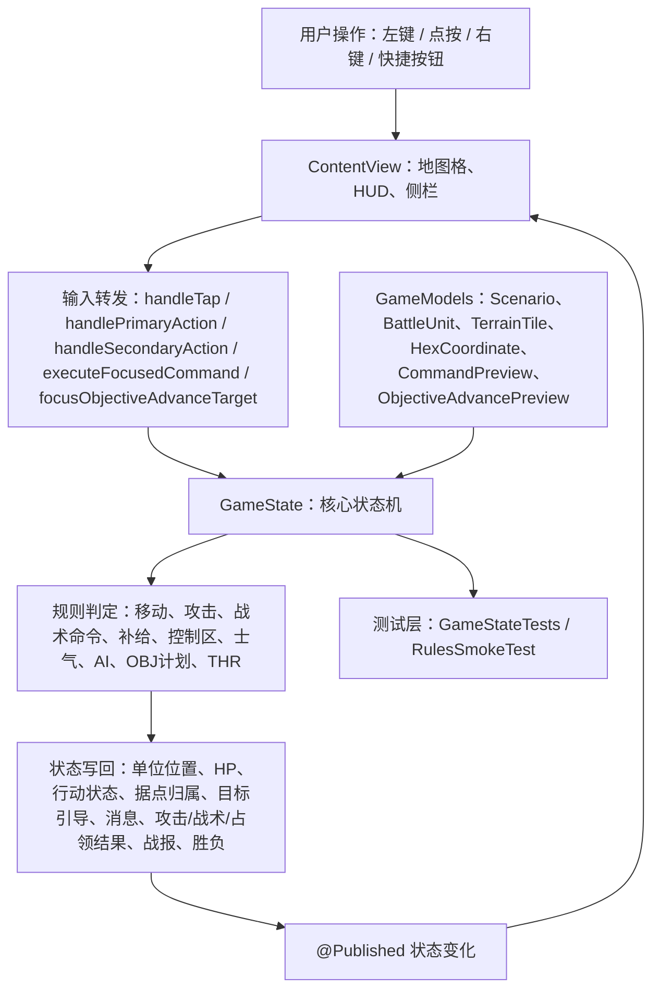
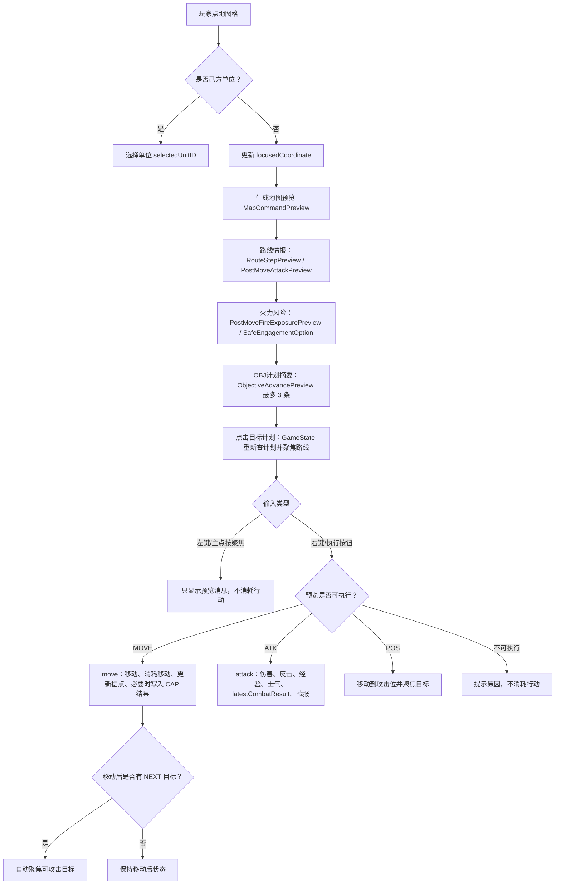
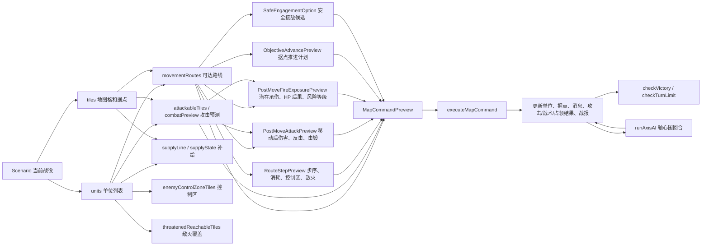
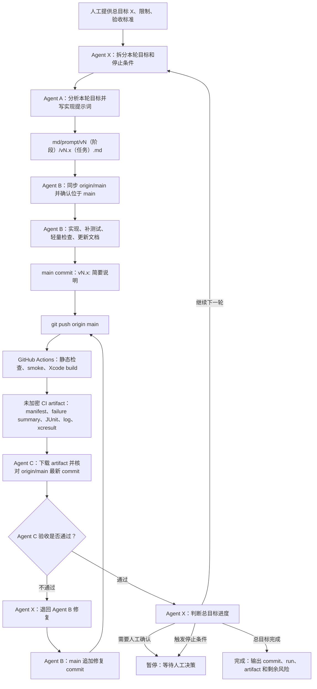
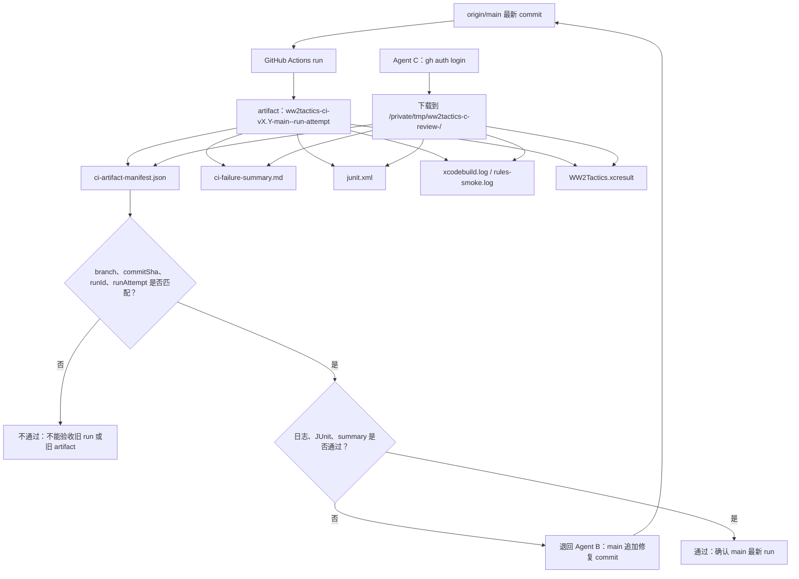

# 项目流程图

本文用 Mermaid 图把当前真实逻辑画出来。每张图前都有读图说明，方便人工快速理解。

## 1. 核心逻辑图

读图说明：这张图从玩家输入开始，看状态如何进入 `GameState`，再如何通过规则更新并回到 SwiftUI 界面。左侧是用户入口，中间是规则状态机，右侧是渲染和测试。

## 2. 地图命令执行流

读图说明：这张图展示地图交互的安全边界。聚焦只看信息，不消耗行动；右键或执行按钮才会进入实际命令执行。

## 3. 规则状态图

读图说明：这张图展示 `GameState` 内部主要规则之间的关系。移动、攻击、补给和 AI 都会影响战役状态，最后统一进入胜负检查。

## 4. Agent X 主控迭代流程图

读图说明：这张图展示未来人工可用 `agentx:` 提供总目标，由 Agent X 拆分轮次并调度 A/B/C。每轮仍必须经过 Agent A 写提示词、Agent B 在 `main` 实现并直推、GitHub Actions 生成 artifact、Agent C 下载并核对结果包；Agent X 只能根据 Agent C 结论决定继续、退回、暂停或完成。

## 5. 云端结果包验收流

读图说明：这张图展示 Agent C 的验收对象不是 Agent B 的文字汇报，而是 `origin/main` 最新 run 上传的未加密 artifact。manifest 中的 commit 和 run 信息必须与远端最新状态一致。

