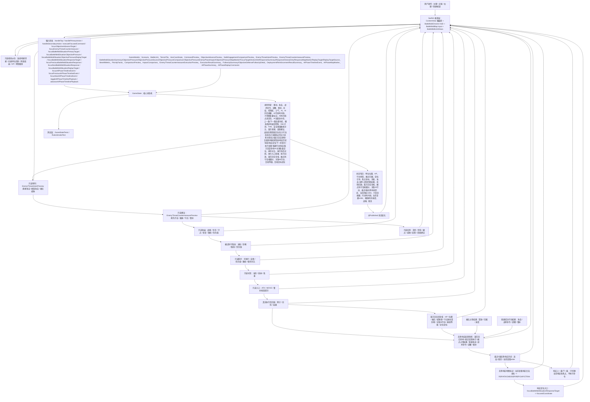
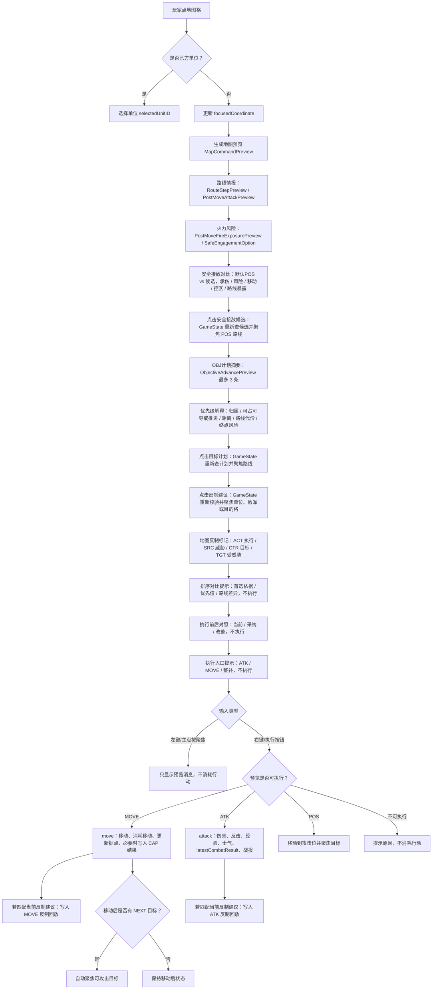
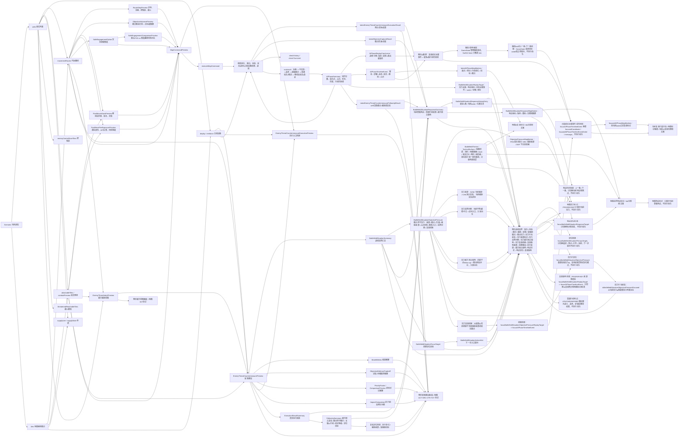
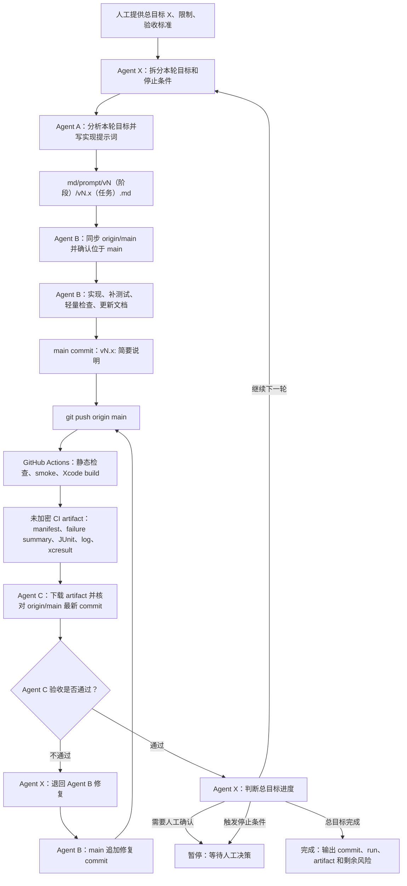
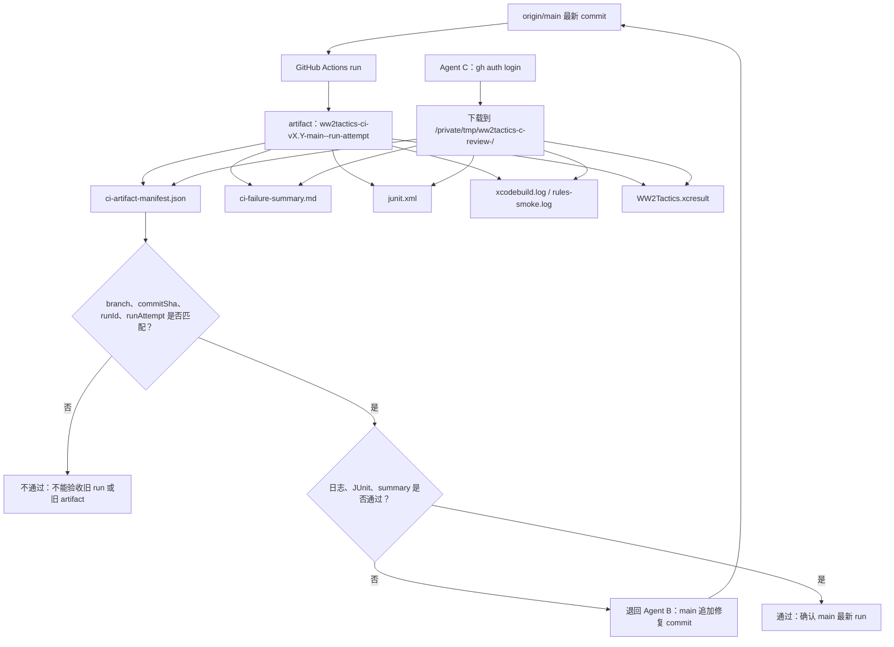

# 项目流程图

本文用 Mermaid 图把当前真实逻辑画出来。每张图前都有读图说明，方便人工快速理解。

## 1. 核心逻辑图

读图说明：这张图从玩家输入开始，看状态如何进入 `GameState`，再如何通过规则更新并回到 SwiftUI 界面。左侧是用户入口，中间是规则状态机，右侧是渲染和测试。

## 2. 地图命令执行流

读图说明：这张图展示地图交互的安全边界。聚焦只看信息，不消耗行动；右键或执行按钮才会进入实际命令执行。

## 3. 规则状态图

读图说明：这张图展示 `GameState` 内部主要规则之间的关系。移动、攻击、补给和 AI 都会影响战役状态，最后统一进入胜负检查。

## 4. Agent X 主控迭代流程图

读图说明：这张图展示未来人工可用 `agentx:` 提供总目标，由 Agent X 拆分轮次并调度 A/B/C。每轮仍必须经过 Agent A 写提示词、Agent B 在 `main` 实现并直推、GitHub Actions 生成 artifact、Agent C 下载并核对结果包；Agent X 只能根据 Agent C 结论决定继续、退回、暂停或完成。

## 5. 云端结果包验收流

读图说明：这张图展示 Agent C 的验收对象不是 Agent B 的文字汇报，而是 `origin/main` 最新 run 上传的未加密 artifact。manifest 中的 commit 和 run 信息必须与远端最新状态一致。

## 地图标记表现（v1.61）

`HexTileView` 将态势/复盘短码收入统一顶/底栈（各最多 2 个 + `+N`），MOVE/ATK/POS 等命令标记固定角落；布局由 View 纯派生，不改变 `GameState` marker 生成与聚焦规则。

## 命令预览呈现（v1.62）

`InlineMapCommandPreview` 与 `FocusedCommandPreviewPanel` 共用 `MapCommandPreviewChrome` 只读 helper 生成图标、色阶、路线/火力/接敌摘要；预览数据仍来自 `GameState.focusedCommandPreview`，不在 View 中重算规则。

## 结果卡视觉（v1.63）

战术命令、据点占领、增援部署与整补结果卡使用与 `CombatResultSummaryView` 同族的标题/结论胶囊/叙述/指标/细节行与渐变底；数据仍来自既有 `latest*Result` 字段。

## 反制回放视觉（v1.64）

`EnemyThreatCountermeasureExecutionResultSummaryView` 与 `EnemyThreatCountermeasureFollowUpSummaryView` 使用与战斗/后勤结果卡同族的标题/结论胶囊/叙述/主体块/指标/细节行；定位按钮与关联 AI 行动仍只转发 `GameState`，不执行命令。

## 地图 HUD 密度（v1.65）

`StatusStrip`、`MapCampaignHUD`、`MapActionHUD` 与快捷命令按钮改为更紧凑布局；工具栏副标题改为缩放/焦点摘要，避免与消息条重复。所有数值与命令仍来自 `GameState`。

## 侧栏与触控（v1.66）

`InspectorPanel` 以分区标题组织主操作、战线态势、执行结果、敌情与反制、战报；编队条、定位条、战术条图标按钮、部署与单位详情主按钮放大触控目标。内容与 action 仍只转发 `GameState`。

## 图例与编队条（v1.67）

`MapLegendView` 与 `ForceRibbon` 使用统一指挥台背板、标题条与阵营标签；`UnitRibbonButton` 选中态使用阵营色强调。图例条目与编队数据来源不变。

## 窄屏布局（v1.68）

`ContentView` 按宽度断点切换并排 inspector 与上下堆叠；地图宽度较窄时 `MapCampaignHUD`/`MapActionHUD` 改为紧凑叠放，减少互相挤压。规则与命令入口不变。

## 动态字体与基础面板（v1.69）

`VictoryPanel`、`ScenarioPanel`、`TileDetail`、`BattleLogView` 对齐指挥台卡片样式；正文使用语义字体并配合 `lineLimit`/`minimumScaleFactor`。数据仍来自 `GameState`。

## 单位详情与战术条（v1.70）

`UnitDetail` 以状态/作战方案/指挥分区组织侧栏单位面板；`TacticalOrderStrip` 与 `ReinforcementDock` 使用统一指挥台背板。命令与数据仍来自 `GameState`。

## 状态面板（v1.71）

`SupplyPanel`、`MoralePanel`、`ExperiencePanel`、`ThreatSummary`、`StatRows` 与 `ActionBadge` 使用统一指挥台卡片样式与可缩放文案。状态数值仍来自 `GameState`。

## 作战规划面板（v1.72）

`ObjectiveAdvancePlanPanel`、`SafeEngagementOptionsPanel`、`TacticalCommandGroup` 与 `CommanderView` 使用统一指挥台卡片样式；点选仍只聚焦或调用既有 `GameState` 战术入口。

## 敌情与反制面板（v1.73）

`EnemyThreatIntentPanel` 与 `EnemyThreatCountermeasurePanel` 使用统一指挥台渐变卡片；行组件强化当前预览态。威胁/反制数据与聚焦入口仍来自 `GameState`。

## 反制下一步反馈（v1.74）

`EnemyThreatCountermeasureExecutionHint` 突出可执行/不可执行与入口说明；`EnemyThreatCountermeasureFollowUpAIEventRow` 提高触控高度。提示与定位仍只转发 `GameState`，不会自动执行命令。

## 态势响应与 AI 回放反馈（v1.75）

`BattlefieldSituationResponseCard` 使用指挥台渐变卡片并强化结果胶囊；`AIPhaseReplayControls` 与 `AIPhaseCurrentTimelineEventView` 突出播放态与当前事件。行为仍只调用既有 `GameState` 导航/播放入口。

## 据点压力与复盘入口（v1.76）

`BattlefieldSituationObjectivePressureRow` 与 `BattlefieldSituationReplayTargetButton` 使用更强的指挥台卡片与当前态反馈。定位/复盘仍只转发 `GameState`。
