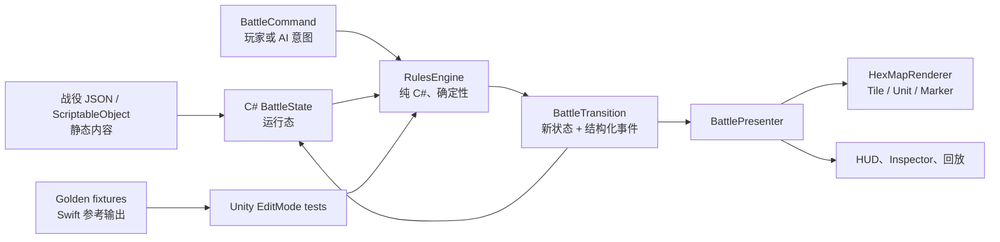

# WW2Tactics Unity 迁移可行性分析报告

日期：2026-07-26
结论：**不建议立刻全量改用 Unity；当目标明确扩展为 Android / PC、多战役内容生产、可视化战斗演出或更重的地图效果时，建议启动一个可回退的 Unity 纵切验证。**

当前 SwiftUI 原型已经能支撑近期的地图可玩性和规则完善。Unity 能解决的是跨平台发布、内容工具和动态表现能力，而不是当前规则正确性或 22x14 六角地图的性能问题。直接重写会同时失去一套已验证的规则、触控交互、辅助功能和 iOS 验证链，风险高于收益。

## 1. 评估范围与事实依据

本报告以当前工作树为准，只评估技术路线，不修改玩法实现或工程配置。

| 项目事实 | 当前证据 | 对路线选择的意义 |
| --- | --- | --- |
| 平台 | iOS 17+，iPhone 与 iPad，Swift 5 | 现有工程是原生单平台工程，Android / Windows / macOS 尚无交付路径。 |
| 规则规模 | `GameState.swift` 6,596 行、278 个方法声明 | 规则不是一个可轻易翻译的小原型；必须以行为对照而非人工目测移植。 |
| 规则数据 | `GameModels.swift` 3,421 行，包含枚举、战役生成和结果/预览模型 | 规则和内容同处一个 Swift 文件，先拆数据契约才能稳定跨语言。 |
| 表现层 | `ContentView.swift` 6,274 行，地图/HUD/单位视觉已拆出四个文件 | SwiftUI 压力主要是复杂 UI 的维护，不是它无法渲染当前规模地图。 |
| 当前地图 | 阿登 22x14、诺曼底 10x7；战役直接在 Swift 中构造 | 规模远未要求 ECS、3D 或大型 Tilemap 优化；硬编码内容会阻碍后续规模化生产。 |
| 已有验证资产 | 115 个 XCTest 方法、RulesSmokeTest 中 1,333 个 `require` 调用、云端规则/构建/截图证据 | 这是迁移最有价值的资产，必须转化为跨引擎 golden fixtures。 |
| 运行时状态 | `GameState` 是 `@MainActor` `ObservableObject`，用 `@Published` 驱动 SwiftUI | 状态机与 SwiftUI 有可分离边界，但当前不是独立的跨平台核心库。 |
| 输入与画面 | 六角命中使用 `UIViewRepresentable` + UIKit 手势；地图由 SwiftUI 逐格叠层绘制 | Unity 需要重做触控、鼠标主/次键、命中、HUD、抽屉、无障碍和全部视觉反馈。 |
| 内容与存档 | 没有资源目录，也未发现持久化或 JSON 编解码实现 | 现在迁移成本相对可控，但必须先设计稳定 ID、存档和内容数据格式。 |
| CI | 现有 GitHub Actions 仅面向 macOS/Xcode，执行静态检查、Swift smoke、`build-for-testing` 和模拟器截图 | Unity 需要新增许可、激活、缓存、构建和结果包策略；当前还没有这套基础设施。 |

关键源码位置：

- [`GameState.swift`](../../WW2Tactics/WW2Tactics/GameState.swift) 第 3-29 行声明了主线程状态机与发布状态；第 2248 行起是战斗预判；第 5366 行起是回合推进；第 5522 行起是实际攻击结算。
- [`GameModels.swift`](../../WW2Tactics/WW2Tactics/GameModels.swift) 第 3029-3068 行定义单位运行时状态；第 3147 行起在代码中构造战役。
- [`BattlefieldMap.swift`](../../WW2Tactics/WW2Tactics/BattlefieldMap.swift) 第 4-118 行把状态机派生状态投影为六角地图；第 1992-2090 行处理精确六角命中和不同输入方式。
- [`.github/workflows/ci-results.yml`](../../.github/workflows/ci-results.yml) 目前只构建与验证 Xcode 工程，不包含 Unity 构建任务。

## 2. 是否应该转到 Unity

### 当前建议：保留 SwiftUI 主线，开始 Unity 可行性纵切的准备工作

截至当前阶段，不应因为“游戏项目通常用 Unity”而停止 SwiftUI 开发。当前目标仍是 EasyTech 风格的二维回合制战棋，核心价值是规则、信息可读性和地图操作；现有实现已经有两张战役地图、规则预判、AI 回放、战斗结果和云端截图验收。22x14 的静态六角网格与少量单位对 SwiftUI 没有天然的性能压力。

应在下面任意一项被确定为近期目标时，批准 Unity 纵切：

1. 必须同时发布 iOS、Android 和 PC，且不接受两套 UI/规则实现。
2. 需要持续增加数十张战役、地图编辑器、可配置部队/将领/科技和设计师可编辑数据。
3. 需要 60 FPS 的移动、弹道、爆炸、镜头、粒子、着色器地形或可缩放的大地图演出。
4. 需要更成熟的 2D 资源导入、分层、图集和场景制作工作流。
5. 团队已有 Unity 负责人、有效的移动平台构建许可及可维护的 Unity CI 环境。

下列情形不构成迁移理由：仅仅想让画面“像游戏”、想修复一两处 SwiftUI 界面维护问题、当前只有 iOS 目标、或尚未确认 Android/PC 与编辑器需求。它们应优先用现有 `BattlefieldMap`/`BattlefieldUnitViews` 的继续拆分、性能 profiling 和资源方案解决。

### 决策矩阵

| 维度 | 继续 SwiftUI | 改为 Unity | 当前判断 |
| --- | --- | --- | --- |
| iOS/iPad 地图操作、抽屉、辅助功能 | 强，已有实现与验证 | 需要完整重做 | SwiftUI 占优 |
| Android / Windows / macOS 交付 | 无 | 强 | Unity 占优，但需求尚未确认 |
| 当前六角格性能 | 足够；需先实际 profile | 足够但引擎开销更高 | 无迁移必要 |
| 2D 战斗演出与镜头 | 可做，复杂度会持续上升 | 更成熟 | 只有确定演出目标时 Unity 占优 |
| 内容生产/编辑器 | 当前硬编码，弱 | ScriptableObject/自定义编辑器较强 | 两端都需先数据化 |
| 已有规则与测试复用 | 直接可用 | 只能作为规格与对照，不能直接运行 | SwiftUI 占优 |
| 总迁移风险 | 低，渐进改进 | 高，UI、规则、测试、CI 同时重建 | 不应全量一次性切换 |

## 3. 为什么不能直接把 Swift 代码翻译成 C#

### 3.1 可移植的是行为，不是现有类

`GameState` 已把大部分规则放在 View 之外，这是正确的边界，也使迁移具备可行性；但它的公开状态、AI 临时基线、预览、时间线、消息和 UI 定位状态都集中于同一个 `@MainActor` 对象。Unity 不能直接使用 Swift 的 `ObservableObject`、`@Published`、Swift `UUID` 或 Xcode 目标。

在 C# 中重新实现时，必须明确区分三类对象：

| 类别 | Swift 当前形态 | Unity 目标形态 | 规则 |
| --- | --- | --- | --- |
| 静态内容 | `Scenario`、地形、单位初始配置在 Swift 工厂函数内 | 版本化 JSON 或 ScriptableObject；运行时加载为不可变内容 | 不把运行中 HP、所有权、行动标记写回资产。 |
| 运行态 | `Scenario.units`、回合、指令点、选择/聚焦、结果摘要 | `BattleState` 纯 C# 数据对象 | 每次命令以旧状态产生新状态和结构化事件。 |
| 规则服务 | `GameState` 的移动、战斗、AI、预览派生方法 | 不依赖 `MonoBehaviour` 的 `RulesEngine` / `BattleReducer` | 不能读取场景物体、`Time`、随机数或 UI。 |
| 显示状态 | SwiftUI `@Published` 与局部 `@State` | `BattlePresenter` + ViewModel / 受控 UI 状态 | 只能消费 `BattleState` 和事件，不能改写规则。 |

### 3.2 迁移前必须消除的技术债

1. **稳定单位 ID。** `BattleUnit.id` 目前由 `UUID()` 生成。跨语言 fixture、回放、存档、网络同步和测试都需要内容定义的稳定字符串 ID，例如 `ardennes-allies-m10-01`；名称不是 ID。
2. **战役数据外置。** 两个战役目前是 Swift 分支/循环构造。先定义带 `schemaVersion` 的战役 JSON，再由 Swift 加载或至少导出相同格式，Unity 才能避免复制地图生成逻辑。
3. **命令与事件契约。** 以 `SelectUnit`、`FocusTile`、`Move`、`Attack`、`Wait`、`UseTacticalCommand`、`Deploy`、`Reinforce`、`EndTurn` 等结构化命令替代 View 与状态机之间的隐式调用序列。预览命令不得改变运行态。
4. **确定性。** 坐标遍历、候选排序、AI 行动、日志 order 和 ID 都必须稳定。禁止用 `Dictionary` 遍历顺序、真实时间、引擎帧率或未设 seed 的随机数决定规则结果。
5. **结果事件。** 把现有 `CombatResultSummary`、AI 时间线、据点占领和后勤摘要整理成可序列化事件。Unity 画面和 SwiftUI 都以这些事件播放反馈，不能重算伤害来生成动画文本。
6. **存档边界。** 当前没有持久化。应在切换前定义存档版本、战役版本、运行态、事件序号与迁移策略；不要把 Unity 场景对象序列化为存档。

## 4. 推荐的目标架构

第一版 Unity 不应使用 3D、ECS/Entities、网络同步或付费第三方框架。它们不能降低首个纵切的风险。建议采用已获许可的 Unity LTS、2D URP、原生 Input System、uGUI 覆盖层与自定义轴向六角坐标；是否采用 UI Toolkit 可在纵切后再决定，不作为规则迁移前提。



建议的 Unity 目录边界：

```text
Assets/WW2Tactics/
  Content/
    Scenarios/                 # JSON 或 ScriptableObject，静态战役数据
  Rules/
    Model/                     # Coordinate, UnitState, BattleState, Command, Event
    Engine/                    # Movement, Combat, Supply, AI, Objectives, Reducer
    Serialization/             # schema version、加载、存档
  Presentation/
    Map/                       # 六角布局、地形、单位、marker、镜头
    HUD/                       # 工具栏、Inspector、回放
    Input/                     # touch、mouse、点击到 BattleCommand
  Tests/
    EditMode/                  # 规则和 fixture 对照
    PlayMode/                  # 输入、地图呈现、首屏场景
```

这不是把 `GameState.swift` 按文件名翻译。先按“坐标/路径、战斗、后勤/目标、AI、时间线、命令 reducer”拆成可测 C# 服务；`MonoBehaviour` 只管理生命周期、场景绑定、镜头和动画。

## 5. 分阶段迁移方案

### 阶段 0：作出可验证的立项决定

前置条件：人工确认至少一个 Unity 触发条件，并明确首发平台、是否保留 SwiftUI、目标美术/演出范围、Unity 许可和 CI 凭据负责人。

产物：一页产品目标、平台矩阵、预算/许可记录、结束条件。未满足时，继续在 SwiftUI 主线推进 v2.x，不创建半成品 Unity 工程。

### 阶段 1：先让现有规则成为可比规格

1. 为单位、据点、战役、命令、事件定义稳定 ID 与 schema 版本。
2. 把两个战役导出为版本化 JSON；Swift 仍可保留加载适配层，功能不可变化。
3. 从现有 XCTest / smoke 挑选覆盖移动、攻击/反击、补给、士气、控制区、据点、部署、整补、AI、回放的最小 golden cases。
4. 每个 case 包含 `initialState`、`commands`、`expectedState`、`expectedEvents`，仅比较稳定字段，禁止比较展示文案或运行时 UUID。
5. 固定顺序和数值规则，补齐失败命令“不改变状态”的断言。

验收：Swift 执行 fixture 后的规范化 JSON 与预期完全一致；现有 smoke 仍通过。此阶段的价值即使不迁移 Unity 也成立。

### 阶段 2：创建独立 Unity 纵切，而非替换 App

新建独立 Unity 工程或明确隔离的 monorepo 子目录；不要把 `Library/`、`Temp/`、`Logs/`、本机构建产物纳入 Git。保留现有 `WW2Tactics` Xcode 工程及其 CI。

纵切范围严格限制为：

- 一张诺曼底地图；
- 4 类单位、地形、选择、聚焦、移动、攻击、反击、结束回合；
- 现有的一条 AI 基础行动链；
- 一个 HUD 和一个 Inspector；
- 同一批 golden fixtures 的 EditMode 对照；
- 一张 PlayMode 首屏截图或视频证据。

明确不做：阿登大地图完整复刻、所有反制/态势卡、存档、多人、商店、复杂 shader、真实美术管线、全部 SwiftUI 面板的像素级复制。

验收门：Unity 所有纵切 fixture 通过；移动/攻击后状态和事件与 Swift 参考输出逐字段相等；iOS 或目标设备上有真实输入与截图证据；没有引入规则层对 `MonoBehaviour` 的依赖。

### 阶段 3：规则覆盖扩展与数据驱动内容

按依赖关系扩大，不按 UI 截图“看起来像”扩大：

1. 路径、控制区、火力覆盖、安全接敌和预览。
2. 补给、士气、将领、夹击、战术命令、增援与整补。
3. 据点、胜负、星级、完整 AI 与时间线。
4. 反制、态势汇总、压力/回放等解释性结果。
5. 第二张战役和一个小型内容编辑/导入流程。

每扩展一个规则域，就先新增/固化 Swift fixture，再实现 C#，最后新增 Unity EditMode 测试。不要在 Unity 中用 UI 条件分支补规则差异。

### 阶段 4：表现层、可用性与发布基础

- 用事件驱动单位移动、攻击、伤害数字和回放，动画期间锁定或排队命令，规则状态不能被动画时间推进。
- 重建触控、长按/右键语义、镜头缩放、44pt 等效目标区、文字缩放、色盲对比与屏幕阅读器策略。
- 为静态地貌、单位、覆盖层、结果层制定渲染排序和性能预算；大地图采用分块或可见区更新前先 profile，当前不要预先引入 ECS。
- 定义 JSON 存档回归测试，并在版本升级时执行存档迁移测试。
- 新增 Android/iOS/PC 构建矩阵、Unity EditMode/PlayMode 报告、截图/日志 artifact 与失败摘要。

### 阶段 5：并行发布与切换

先让 SwiftUI 版本保持可运行，Unity 仅向内部测试者发布。选同一战役、同一 fixture、同一回合脚本对比规则、操作和性能。只有满足以下条件才停止 SwiftUI 功能开发：

1. Unity 覆盖所有当前正式玩法命令和两张战役；
2. fixture 无已知规则差异，且包含历史高风险攻击预判/反击场景；
3. 目标平台的构建、截图和回归测试均自动化；
4. 存档与版本升级策略完成；
5. 人工验收地图操作、信息密度和无障碍不低于当前版本。

否则应把 Unity 视为验证分支/后续产品，而不是替换已有 App。

## 6. 规则对照与测试策略

### Golden fixture 示例

```json
{
  "schemaVersion": 1,
  "caseID": "normandy-tank-attack-counterattack",
  "scenarioID": "normandy-1944",
  "initialState": { "...": "只使用稳定 ID 与数值字段" },
  "commands": [
    { "kind": "selectUnit", "unitID": "normandy-allies-tank-01" },
    { "kind": "attack", "targetUnitID": "normandy-axis-tank-01" }
  ],
  "expectedState": { "...": "HP、士气、经验、行动标记、回合、据点归属" },
  "expectedEvents": [
    { "kind": "combatResolved", "damage": 0, "counterDamage": 0 }
  ]
}
```

数值 `0` 只是 schema 占位，不应成为预期结果。fixture 必须来自当前 Swift 规则的受控测试状态，不能从手工截图抄录。

| 层次 | Swift 参考实现 | Unity 实现 | 通过条件 |
| --- | --- | --- | --- |
| 数据 | XCTest / smoke 读取战役 fixture | EditMode 加载相同 fixture | schema、稳定 ID、地图与初始单位一致 |
| 规则 | Swift 执行命令序列 | `RulesEngine` 执行命令序列 | 新状态和事件逐字段一致 |
| UI 契约 | 既有地图输入链与 CI 场景参数 | PlayMode 模拟 touch/mouse | 同一命令被派发一次，不会误执行 |
| 视觉 | iOS 模拟器截图 | 目标设备/PlayMode 截图 | 地图非空、关键选中/战斗状态可辨，人工审核 |
| 发布 | Xcode CI artifact | Unity CI artifact | commit、平台、测试结果、截图和日志可追溯 |

现有 `RulesSmokeTest` 覆盖面广，但它是单个 Swift 可执行程序，不能直接成为 Unity 测试。应把其最稳定的断言转换为共享 fixture；保留 Swift smoke 作为参考实现回归，直到 Unity 完全替代且人工明确批准退役。

## 7. Unity CI 与仓库前置条件

当前工作流只在 `macos-latest` 上构建 Xcode 项目。Unity 进入 CI 前必须由人工提供并确认：

1. 可用于无人值守构建的 Unity 许可方式、账号/组织归属与密钥存放方案；不得把许可证或激活文件提交到仓库。
2. 固定的 Unity LTS 版本、iOS/Android/Windows 模块和 package lock 策略。
3. Unity 的缓存上限、artifact 白名单、失败日志和截图格式；禁止上传 `Library`、完整构建缓存、历史录像或无关资源。
4. Unity 工程的 `.gitignore`、meta 文件规则、文本序列化规则与冲突处理约定。
5. iOS Unity 输出的签名/导出责任边界，以及 Android keystore 的保管人。

建议把 Xcode CI 与 Unity CI 暂时分成两个独立 workflow，各自产出 manifest。切换前由一个聚合检查读取两边的 fixture 版本和 commit SHA；不要让一个“通过的 Unity 截图”替代 Swift 规则 smoke，也不要以 Swift CI 成功证明 Unity 可发布。

## 8. 成本、风险与缓解措施

| 风险 | 后果 | 缓解措施 |
| --- | --- | --- |
| 全量翻译规则 | 攻击预判、反击、AI 或结果摘要悄然不一致 | 先 fixture 化，C# 逐域移植并逐字段比较。 |
| 同时重写 UI 和规则 | 无法定位失败来自输入、显示还是战棋逻辑 | 纵切只覆盖一个战役和基本动作；规则先过 EditMode。 |
| 不稳定 ID / 硬编码内容 | 存档、回放、测试、Unity 数据引用全部脆弱 | 在 Swift 仍为主线时先引入稳定 ID 和版本化 schema。 |
| Unity 依赖蔓延到规则层 | 测试慢、不可复现、难以 headless CI | `RulesEngine` 不引用 `UnityEngine`、场景物体或帧时间。 |
| 新 CI 无许可或证书 | 本地能跑、云端不能构建 | 阶段 0 先确认许可、平台模块和 secrets。 |
| 画面提升掩盖交互退步 | 地图可玩性、无障碍和信息密度倒退 | 建立操作脚本与人工对比验收，保留 SwiftUI 对照版本。 |
| 原生 UI 优势丢失 | iPad 抽屉、Dynamic Type、VoiceOver 退化 | 把现有辅助功能与最小触控尺寸列成 Unity 发布门禁。 |
| 过早引入 3D/ECS/资产管线 | 延迟第一个可玩版本且难排障 | 2D 纵切先验证产品价值和规则迁移，再以 profile 决定。 |

## 9. 推荐的下一步

1. 人工确认是否已具备 Android/PC、动态战斗演出或内容编辑器三者之一的近期需求；若没有，继续 SwiftUI v2.x，不立项 Unity。
2. 若确认迁移，先开“稳定 ID + 战役 JSON + golden fixture”任务。它必须保留所有现有规则行为，并由 Swift XCTest/smoke 验证。
3. 取得 Unity 许可与 CI 方案后，再创建独立 Unity 纵切，首批只做诺曼底基本回合链。
4. 纵切通过后再依据 fixture 一致性、目标设备表现、内容生产效率和团队维护能力作 Go/No-Go 决定。

**最终判断：**项目应从“SwiftUI 原型”演进为“数据驱动、可测试的战棋规则产品”，但是否采用 Unity 取决于跨平台与内容生产目标。现在最正确的投资不是立即重写，而是先把规则和内容变成两端都能验证的契约；这既降低 Unity 迁移风险，也直接改善当前 SwiftUI 项目的可维护性。
